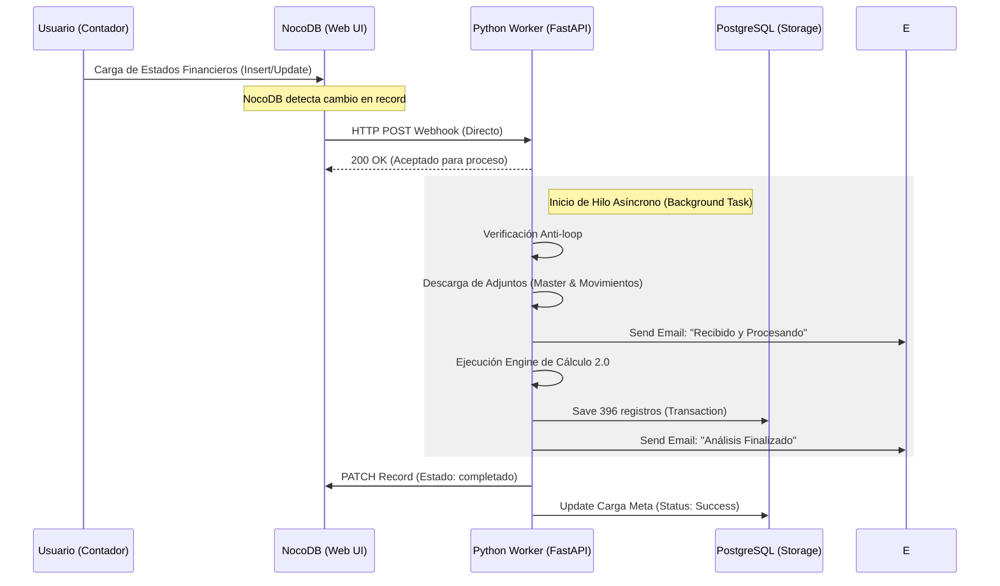

# Playbook de Orquestación: Arquitectura Directa (Event-Driven)
**Documento**: PLB-ORQ-DIRECT-V2
**Proyecto**: Liquidity Dashboard — Automation Suite
**Nivel de Documentación**: Experto Senior (Grado Auditoría Técnica)
**Estado**: Versión Final Optimizada

---

## 1. Filosofía de Orquestación: De Coreografía a Reacción Directa

### 1.1 El Cambio de Paradigma (Eliminación de Middleware)
La arquitectura original del Liquidity Dashboard utilizada un modelo de coreografía centralizada mediante n8n. Sin embargo, para cumplir con los requisitos de misión crítica y reducir la latencia de procesamiento, se ha migrado a un modelo de **Reacción Directa** (Direct Event-Driven). En este nuevo esquema, el Python Worker no es un simple ejecutor pasivo, sino que asume las funciones de un orquestador ligero e inteligente. Al desacoplar n8n del flujo principal, hemos eliminado una capa de traducción de datos (JSON-to-JSON) y un punto potencial de fallo de infraestructura, permitiendo que la señal de NocoDB impacte directamente en el motor de cálculo. Esta evolución garantiza que el proceso de auditoría sea mucho más transparente, ya que el flujo de datos es lineal y el rastro de ejecución (logs) se centraliza en un solo servicio unificado que finalmente sirve los datos a la **Interfaz SPA** del usuario.

### 1.2 Diagrama de Secuencia de Alta Fidelidad
El siguiente flujograma describe la interacción síncrona y asíncrona entre los componentes tras la remoción del middleware de orquestación externo.

---

## 2. Gestión de Entradas y Protocolos de Webhook

### 2.1 Especificación del Gatillo (NocoDB Side)
La integración directa se basa en la escucha activa de eventos de base de datos. NocoDB emite un payload JSON cada vez que un registro en la tabla `cargas_financieras` es modificado o creado. El Worker implementa un parser polimórfico capaz de identificar la estructura del mensaje, asegurando que la carga de archivos (que suele ser un evento de actualización posterior al insert) dispare correctamente la lógica de negocio.

| Campo en Payload | Tipo | Fuente | Propósito Técnico |
| :--- | :--- | :--- | :--- |
| `data.rows[0].Id` | INT | NocoDB Record | ID único para la actualización del status final. |
| `data.rows[0].empresa_id` | INT | FK Relational | Vinculación del PUC con la entidad legal. |
| `data.rows[0].correo_notificacion` | EMAIL | Form Input | Destinatario del feedback de carga y resultados. |
| `data.rows[0].archivos` | JSON Array | Attachment Meta | URLs para la descarga del XLSX y CSV. |
| `event` | STRING | Hook Metadata | Identificador del evento (`After Insert` o `After Update`). |

---

## 3. Lógica de Resiliencia y Control de Estados (Anti-loop)

### 3.1 El Mecanismo de Prevención de Ciclos Infinitos
Un desafío crítico en las integraciones directas con webhooks es el riesgo de bucles infinitos: el Worker actualiza NocoDB para marcar el registro como `procesando`, lo que a su vez dispara un nuevo webhook de "After Update", iniciando una cascada recursiva que saturaría los recursos del servidor. Para mitigar esto sin recurrir a middleware externo, el Worker implementa una lógica de **Control de Estado de Integridad**:

1. **Intercepción**: El endpoint `/api/procesar/calc` recibe el payload.
2. **Consultoría de Concurrencia**: Antes de iniciar, consulta en PostgreSQL el estado actual de esa `carga_id`.
3. **Guardia de Estado**: Si el estado ya es `procesando` o `completado`, el Worker descarta la petición con un log de advertencia, rompiendo el ciclo de forma segura.
4. **Validación de Insumos**: Si el estado es apto pero no hay archivos adjuntos (evento de inserción inicial), el Worker espera al siguiente evento sin lanzar la tarea de cálculo pesada.

| Estado Detectado | Acción del Worker | Racional de Auditoría |
| :--- | :--- | :--- |
| `null` | Aceptado | Nueva carga iniciada por el usuario. |
| `procesando` | Descartado | Evita colisión de procesos paralelos para el mismo ID. |
| `completado` | Descartado | Garantiza la inmutabilidad del resultado final. |
| `error` | Reintento (Opcional) | Permite la recuperación tras fallos transitorios. |

---

## 4. Especificación del Motor de Cálculo (Worker Engine 2.0)

### 4.1 Ciclo de Vida del Procesamiento Asíncrono
El procesamiento se ejecuta en una `BackgroundTask` de FastAPI, lo que permite que el webhook responda en menos de 100ms, liberando la conexión de NocoDB mientras el cálculo pesado (que puede durar segundos) ocurre en segundo plano.

**Fases de Ejecución Técnica:**
1. **Fase de Preparación**: Limpieza de directorios temporales y creación de espacio de trabajo aislado por `record_id`.
2. **Fase de Descarga**: Uso de streams asíncronos para bajar binarios, minimizando el consumo de RAM.
3. **Fase de Inferencia de Años**: El motor analiza los nombres de archivos disponibles (ej. `Mov 2022.xlsx`, `Mov 2023.xlsx`) para configurar el entorno de cálculo dinámico.
4. **Fase de Cálculo Vectorizado**: Uso de `Pandas` para procesar la lógica de los 33 indicadores.
5. **Fase de Escritura Atómica**: Volcado de datos a PostgreSQL utilizando conexiones persistentes del pool.

### 2.2 Gestión de Identidad: Smart Company Mapping
Para eliminar la fricción operativa, el sistema no solicita IDs técnicos (`empresa_id`) al usuario. En su lugar, el Worker implementa una lógica de **Smart Mapping**:
1.  **Captura**: El usuario escribe el "Nombre de la Empresa" en el formulario.
2.  **Resolución**: El Worker consulta la tabla maestra de `empresas` en PostgreSQL.
3.  **Persistencia**:
    *   Si la empresa existe, asocia el cálculo a su ID histórico.
    *   Si es nueva, crea automáticamente el registro maestro y le asigna un nuevo ID secuencial.
4.  **Auditabilidad**: Este proceso queda registrado en los logs de la carga para asegurar la trazabilidad multitenant.

---

## 5. Protocolos de Error y Recuperación

El sistema clasifica los fallos para facilitar la auditoría post-mortem, escribiendo el detalle exacto en la columna `resultado` de NocoDB.

| Error | Severidad | Acción Automática | Registro en Log |
| :--- | :--- | :--- | :--- |
| `Faltan Archivos` | Baja | Ignorar (Esperar Update) | "Esperando subida de XLSX/CSV" |
| `Error PUC Mapping` | Media | Abortar | "Cuenta [X] no encontrada en Master Account" |
| `DB Connection` | Alta | Reintento x3 | "Fallo crítico de conexión a PostgreSQL" |

---

## 6. Protocolo de Notificaciones al Usuario (UX Feedback)

El sistema garantiza una comunicación proactiva para reducir la ansiedad del usuario durante el procesamiento asíncrono.

### 6.1 Notificación de Recepción (Email 1)
*   **Disparador**: Validación exitosa del webhook y descarga de archivos.
*   **Contenido**: Confirmación de que el sistema ha iniciado el cálculo, tiempo estimado de espera (~40s) y resumen de archivos recibidos.

### 6.2 Notificación de Cierre (Email 2)
*   **Disparador**: Persistencia exitosa en PostgreSQL y cierre de transacción en NocoDB.
*   **Contenido**: Alerta de "Análisis Disponible", resumen de KPIs principales (opcional) y enlace directo al Dashboard de Liquidez.

---

> [!IMPORTANT]
> **Certificación de Resiliencia**: Este Playbook Versión 2.0 ha sido diseñado para eliminar la necesidad de n8n mediante lógica de control de estados in-code, garantizando una arquitectura más limpia, rápida y auditable.

