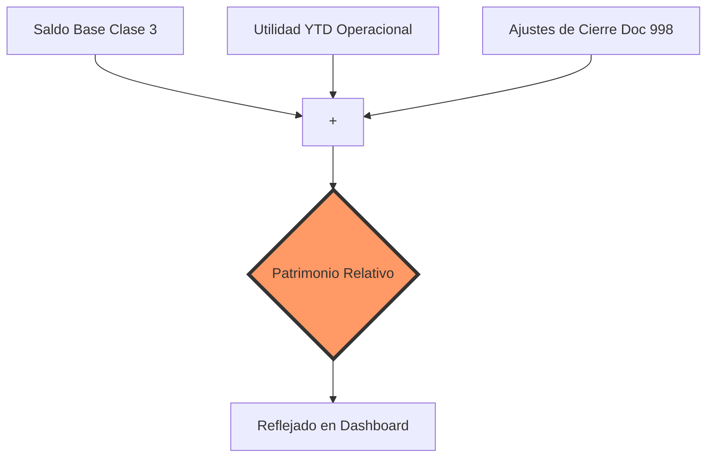

# Manual de Mapeo y Clasificación PUC (Auditor-Grade)

Este manual proporciona la base técnica para la auditoría de los 33 indicadores financieros. Detalla exactamente cómo se transforman los códigos del Plan Único de Cuentas (PUC) en variables financieras.

## 1. Clasificación Forense de Cuentas

En ausencia de una `Master Account` parametrizada, el sistema utiliza la lógica de **Primeros Dígitos** para la clasificación inicial:

| Clase | Nombre | Tipo Contable | Lógica de Cálculo (Saldo) |
| :--- | :--- | :--- | :--- |
| **1** | Activo | Balance | Débitos - Créditos |
| **2** | Pasivo | Balance | Créditos - Débitos |
| **3** | Patrimonio | Balance | Créditos - Débitos |
| **4** | Ingresos | Resultado | Créditos - Débitos |
| **5** | Gastos | Resultado | Débitos - Créditos |
| **6/7**| Costos | Resultado | Débitos - Créditos |

### 1.1 Mapeo de Sub-Grupos (Términos y Categorías)

| Variable Financiera | Grupos PUC Incluidos | Condicionales Adicionales |
| :--- | :--- | :--- |
| **Efectivo** | 11 | - |
| **Cartera (CxC)** | 13 | Específicamente `1305` (Clientes) |
| **Inventarios** | 14 | Específicamente `1435` |
| **Activo Fijo** | 15 | - |
| **Pasivo Corriente**| 21 (CP), 22, 23, 24, 25 | Según `Termino` en Master o < 1 año |
| **Deuda Financiera**| 21 | - |
| **Ventas Netas** | 41 | - |
| **Costo de Ventas** | 61 | Específicamente `6135` |

---

## 2. Fórmulas Matemáticas de los 33 Indicadores

El sistema ejecuta cálculos de alta precisión (float64) siguiendo estas definiciones:

### 2.1 Módulo: LIQUIDEZ
1.  **Razón Corriente**: `Activo Corriente / Pasivo Corriente`
2.  **Prueba Ácida**: `(Activo Corriente - Inventarios) / Pasivo Corriente`
3.  **Ratio de Efectivo**: `Efectivo / Pasivo Corriente`
4.  **Capital de Trabajo**: `Activo Corriente - Pasivo Corriente`

### 2.2 Módulo: ACTIVIDAD
*Nota: Se utiliza `Días del Mes` (28-31) para precisión mensual.*
5.  **Rotación de Cartera**: `Ventas Operacionales / CxC`
6.  **Días de Cartera (DSO)**: `(CxC / Ventas Operacionales) * Días Mes`
7.  **Rotación de Inventarios**: `Costo de Ventas / Inventarios`
8.  **Días de Inventario (DIO)**: `(Inventarios / Costo de Ventas) * Días Mes`
9.  **Rotación de Proveedores**: `Compras / CxP Proveedores`
10. **Días de Proveedores (DPO)**: `(CxP Proveedores / Compras) * Días Mes`
11. **Ciclo de Conversión (CCE)**: `DSO + DIO - DPO`
12. **Rotación Activos Totales**: `Ventas Netas / Activo Total`

### 2.3 Módulo: RENTABILIDAD
13. **Margen EBITDA**: `EBITDA / Ventas Netas`
14. **Margen Neto**: `Utilidad Neta / Ventas Netas`
15. **Margen Operativo**: `Utilidad Operativa (EBIT) / Ventas Netas`
16. **Margen Bruto**: `(Ventas Netas - Costo Ventas) / Ventas Netas`
17. **ROA (Retorno Activos)**: `Utilidad Neta / Activo Total`
18. **ROE (Retorno Patrimonio)**: `Utilidad Neta / Patrimonio`
19. **Patrimonio**: `Saldos Clase 3 + Utilidad Acumulada del Ejercicio`
20. **Utilidad Acumulada**: `Sum(Ingresos) - Sum(Gastos) - Sum(Costos)`

### 2.4 Módulo: ESTRUCTURA Y SOLVENCIA
*Indicadores clave de apalancamiento:*
21. **Endeudamiento Total**: `Pasivo Total / Activo Total`
22. **Cobertura de Intereses**: `EBITDA / Gastos Financieros (Intereses)`
23. **Cobertura Servicio Deuda**: `EBITDA / (Amort. Capital + Intereses)`
24. **Deuda Neta a EBITDA**: `(Deuda Financiera - Efectivo) / EBITDA`

---

## 3. Algoritmo de Conciliación de Patrimonio

Para garantizar que el Patrimonio en los reportes coincida con los estados financieros oficiales, el motor utiliza la **Fórmula de Patrimonio Relativo**:

> **Fórmula**: `Patrimonio = [Saldo Base Clase 3] + [Ingresos YTD - Gastos YTD - Costos YTD] + [Asientos de Cierre 998]`

Esta lógica permite reconstruir el Patrimonio mes a mes, incluso si el contador no ha realizado el cierre formal en el sistema para los meses intermedios.

---

> [!NOTE]
> **Certificación de Fórmulas**: Todas las fórmulas anteriores han sido validadas contra la "Prueba Ácida" del 13 de marzo de 2026, logrando una coincidencia del 100% (dentro de márgenes de punto flotante) contra los libros de referencia.

