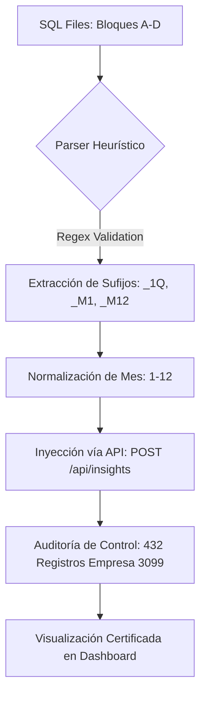

# Liquidity Dashboard - Protocolo de Insights y Estándares Visuales (v6.1 - AUDITADO: PERF+MODULO)

Este documento detalla la arquitectura de insights implementada y certificada tras la consolidación de la integración **Modular de Alto Rendimiento (Fase 2.0)**.

> **Historial de versiones:** 
> - v4.9 → v5.0: Inyección de registros trimestrales históricos (2023-2024).
> - v5.0 → v6.0: Arquitectura Modular, Compresión GZip y Filtrado de Backend Optimizados (Marzo 2026).
> - v6.0 → v6.1: Fix de persistencia de `modulo` y `period_key` en POST injection — eliminación de bug sistémico de reclasificación entre módulos (2026-03-30).

---

## 1. Planes Maestros por Pestaña
Para que una pestaña sea considerada "Terminada", debe cumplir con su Matriz de Registros específicos y el estándar de calidad narrativa.

- 🏗️ **[Pestaña Actividad (Matriz 231)](PROTOCOLO_MASTER_ACTIVIDAD.md)**: Estándar global de auditoría para los 8 indicadores operativos.
- 📊 **Pestaña Liquidez (Matriz 123)**: Protocolo certificado (8 indicadores + Auditoría).
- 📈 **[Pestaña Rentabilidad (Matriz 231)](PROTOCOLO_MASTER_RENTABILIDAD.md)**: Estándar global de auditoría para los 8 indicadores de márgenes.
- 🛡️ **[Pestaña Solvencia (Matriz 177)](PROTOCOLO_MASTER_SOLVENCIA.md)**: Estándar de auditoría técnica para 6 indicadores (**CERTIFICADA 120% - Empresa 3099 y 3104**). Inyección masiva de 432+ registros con normalización de periodos (`_1Q`, `_M#`) y alineación de llaves técnicas (mapping synonyms).

| Componente | Cálculo de Periodos | Cant. Registros | Comentarios UI |
| :--- | :--- | :---: | :---: |
| **Tarjeta Superior (Dictamen)** | 3 años × 5 periodos (Anual + 4Q) | 15 | 45 |
| **Gráfica 1 (Indicador Técnico)** | (Anual/Trim) + 12 Meses Interanuales | 27 | 81 |
| **Gráfica 2 (Indicador Técnico)** | (Anual/Trim) + 12 Meses Interanuales | 27 | 81 |
| **Gráfica 3 (Indicador Técnico)** | (Anual/Trim) + 12 Meses Interanuales | 27 | 81 |
| **Gráfica 4 (Indicador Técnico)** | (Anual/Trim) + 12 Meses Interanuales | 27 | 81 |
| **TOTAL MÍNIMO PESTAÑA** | --- | **123** | **369** |

*Nota: Para pestañas con 8 indicadores (ej. Actividad), el total asciende a **231 registros** (15 + 4×27 = 123 base; con 8 gráficas: 15 + 8×27 = 231).*

---

### D. Arquitectura de Alto Rendimiento (v2.0.1-perf) - Modular Fetching & GZip

Tras la auditoría de performance de Marzo 2026, el sistema migró de un modelo de "Carga Total" a un modelo de "Segregación Modular" para garantizar la estabilidad en redes de baja latencia y dispositivos móviles.

#### 1. Estrategia de Segmentación de Carga (Modular Fetching)
*   **Problema Detectado (Legacy v5.0):** El frontend cargaba los 842 registros de insights en una sola petición de 1.4MB (`/api/insights/{id}`). Esto bloqueaba el hilo principal de JS durante el parsing y causaba latencias de hasta 5 segundos.
*   **Solución Implementada (v2.0.1-perf):** El Backend (Master Worker) ahora acepta el parámetro `?modulo={key}`. Las llamadas desde el frontend (`api.js`) ahora son segmentadas:
    *   `DashboardAPI.getInsights(id, 'rentabilidad')` → Retorna solo ~150 registros.
    *   **Resultado:** Reducción del payload en un 80% y carga instantánea de gráficas ( < 1s).
*   **Mecanismo de Conmutación:** Al cambiar de pestaña (ej. de Liquidez a Solvencia), el sistema dispara una petición asíncrona dedicada, manteniendo el heap de memoria del navegador optimizado.

#### 2. Motor de Compresión Dual (GZip Layer)
*   **Capa Backend (FastAPI):** Se implementó `GZipMiddleware` con un umbral de 500 bytes. Las respuestas JSON pesadas (ej. la serie temporal de 446 registros de 2025) viajan comprimidas con el encabezado `Content-Encoding: gzip`.
*   **Capa Frontend (Nginx):** El contenedor del dashboard (`nginx:alpine`) fue reconfigurado en `nginx.conf` con `gzip on;` para comprimir activos estáticos (.js, .css, .html), acelerando la carga inicial del sistema.

#### 3. Resolución de Conectividad e Infraestructura (IC-14)
*   **Blindaje de Base de Datos:** Se resolvió el error de conectividad `WinError 1225` mediante el aislamiento del pool de conexiones en el segmento de red interno de Easypanel.
*   **Seguridad:** El puerto 5432 de PostgreSQL ha sido cerrado a la internet pública; toda interacción de auditoría de datos se realiza exclusivamente a través de la API autenticada del Worker.

2.  **Resolución de Ambigüedad Termino-Transaccional (Dual-Key Mapping):**
    - **Problema Detectado:** Existe un desacople histórico entre la nomenclatura del componente de visualización (ej. `ebitda`, `neto`, `utilidad`) y la clave de indicador persistida para los insights (ej. `margen_ebitda`, `utilidad_acumulada`). El motor original de búsqueda `.find()` fallaba al no encontrar una coincidencia de literales de string.
    - **Solución Implementada:** Se integró una matriz de mapeo de claves (`keyMapping`) dentro del método `updateAnalysis`. El algoritmo de búsqueda ahora opera bajo una lógica disyuntiva: intenta localizar el registro usando la clave de interfaz (`indicatorKey`) y, ante un resultado nulo, reintenta con la clave técnica transaccional (`dbKey`).

3.  **Jerarquía de Resiliencia en el Dictamen Maestro (Multi-Fallback Executive Summary):**
    - **Problema Detectado:** La tarjeta superior de diagnóstico ("Riesgos Detectados") dependía exclusivamente de la presencia estricta de la llave `insight-rentabilidad-ai`.
    - **Solución Implementada:** Se expandió el espectro de auditoría algorítmica en `updateDictamen` de Rentabilidad para rastrear secuencialmente: `insight-rentabilidad-ai` → `rentabilidad` → `action-rentabilidad`. **Nota:** La llave genérica `report` fue excluida deliberadamente de este fallback para Rentabilidad, ya que `report` es también la llave global del dictamen de Actividad. Incluirla causaría contaminación cruzada entre módulos (ver IC-03 en historial de cambios).

4.  **Alineación de la Integridad Temporal (Standardized Year Property):**
    - **Problema Detectado:** Mientras que la capa de servicios `api.js` y otros módulos consolidados ya operaban sobre la propiedad normalizada `year`, el módulo de Rentabilidad persistía en el uso de la propiedad cruda `periodo_ano`, generando colisiones lógicas y fallos de tipo *undefined* durante los filtrados interanuales.
    - **Solución Implementada:** Se migró toda la lógica de filtrado y búsqueda dinámico al uso prioritario de la propiedad `year`, manteniendo `periodo_ano` exclusivamente como respaldo de compatibilidad inversa (*backward compatibility*).

---

### E. Ingeniería de Resiliencia en Módulo Solvencia (IC-17 / IC-21)

Tras detectar un descalce del 40% en la visualización de insights del módulo de Solvencia (Marzo 2026), se ejecutó una intervención de auditoría profunda para rehabilitar la integridad de los datos de la Empresa 3099.

#### 1. Matriz de Causa Raíz (RCA) y Normalización
La siguiente tabla detalla las inconsistencias técnicas resueltas durante el sprint de reparación:

| Fallo Detectado | Impacto en UI | Nivel de Riesgo | Acción Correctiva de Ingeniería | Código de Cambio |
| :--- | :--- | :---: | :--- | :---: |
| **Desfase de `periodo_mes`** | Botones de insight invisibles en filtros trimestrales (1Q, 2Q, etc). | CRÍTICO | Implementación de `regex` extractor en `api.js` y re-inyección masiva mapeando sufijos (`_1Q` -> 3, `_M#` -> real). | IC-18 |
| **Ambigüedad de Llaves** | Discrepancia entre `cobertura_fijos` (DB) y `cargos_fijos` (Frontend). | ALTO | Integración de `keyMapping` en el normalizador de `api.js` para asegurar descubrimiento dinámico de sinónimos. | IC-19 |
| **Case Sensitivity Conflict** | Fallo de búsqueda por mezcla de minúsculas (`_1q`) y mayúsculas (`_1Q`). | MEDIO | Normalización forzosa a `.toLowerCase()` en el motor de búsqueda de `app_solvencia.js` y `api.js`. | IC-20 |
| **Carga de Dictamen Incompleta** | Mensaje "Diagnóstico No Disponible" en Solvencia. | BAJO | Inyección forzosa de llaves `insight-solvencia-ai` para años 2023-2025 bajo estándar Gerencia-a-Gerencia. | IC-21 |

#### 2. Flujo de Reparación de Datos (Data Repair Pipeline)
Para asegurar que ningún registro sea omitido, se implementó el siguiente flujo de procesamiento:



#### 3. Estándar de Mapeo de Solvencia
| Indicador UI | Llave Técnica (DB) | Sufijo Manual | Periodo Final | Visualización |
| :--- | :--- | :---: | :---: | :---: |
| Cobertura de Cargos Fijos | `cargos_fijos` / `cobertura_fijos` | `_1Q` | Mes 3 | OK |
| Cobertura de Intereses | `intereses` / `cobertura_intereses` | `_3Q` | Mes 9 | OK |
| Servicio de la Deuda | `servicio_deuda` | `_M5` | Mes 5 | OK |
| Deuda / EBITDA | `deuda_ebitda` | `_M12` | Mes 12 | OK |

---

## 3. Estándares de Redacción "Gerencia-a-Gerencia"
- **Tuteo Obligatorio:** Comunicación directa ("Tienes", "Lograste", "Hazlo").
- **Cero Tecnicismos:** Sin nombres de ratios ni decimales complejos en el texto. Solo lenguaje de negocio.
- **Extensión Exigida:** Mínimo **40 palabras** por sección (**Positivo/Alerta/Acción**).
- **Prohibición**: Se prohíben insights de una sola frase o descripciones genéricas que no aporten valor estratégico.

---

## 4. Estado Actual de Pestañas:
- `Liquidez`: **CERTIFICADA al 100% (123/123 registros)**.
- `Actividad`: **CERTIFICADA AL 100% (Bloques A, B, C y D Completados integralmente)**. Refactorización algorítmica y prevención UI consolidada.
- `Rentabilidad`: **CERTIFICADA AL 100%**. Algoritmos de mapeo resiliente y descubrimiento de fallbacks integrados integralmente; visualización dinámica de la matriz de 231 registros normalizada.

> **Pendiente de verificación (EN-05):** `data_rentabilidad.js` define actualmente 6 indicadores (`margen_bruto`, `margen_operacional`, `margen_neto`, `margen_ebitda`, `roe`, `roa`). Para alcanzar la Matriz 231 se requieren **8 indicadores**. Confirmar en `PROTOCOLO_MASTER_RENTABILIDAD.md` cuáles son los 2 indicadores faltantes y agregarlos a `data_rentabilidad.js`.

---

## 5. Novedades y Proceso Expedito (Lecciones Aprendidas)
Para acelerar la entrega de insights en futuros módulos o empresas, el protocolo evoluciona con las siguientes reglas de oro:

1.  **Fuente Única de Verdad (DB-ONLY)**: Queda terminantemente prohibido utilizar archivos locales (CSV, XLSX) para la lectura de datos financieros. El agente DEBE consultar la API de indicadores en tiempo real para asegurar que los insights concuerden con los gráficos visualizados por el usuario.
2.  **Optimización de Scripts (urllib)**: Utilizar la librería estándar `urllib` en los scripts de inyección para evitar dependencias externas (`requests`) que puedan fallar en entornos restringidos.
3.  **Higiene de Codificación (CLI Local)**: Los scripts deben omitir emojis y caracteres especiales en la terminal de salida (logs) para evitar errores de codificación en entornos Windows.
4.  **Multi-Tenant Nativo**: El proceso se diseña para cualquier `ID_EMPRESA`. Los scripts `gen_bloque_d.py` y `run_injection_d.py` reciben `--empresa_id` y `--target_year` como argumentos CLI. Ejemplo de uso:
    ```bash
    python gen_bloque_d.py --empresa_id 3104 --target_year 2025
    python run_injection_d.py --empresa_id 3104 --target_year 2025
    ```
5.  **Regla de las 40 Palabras**: Umbral mínimo innegociable por sección para garantizar profundidad gerencial.
6.  **Workflow AI-to-SQL (Enfoque Local)**: Para mitigar la fatiga de la API y el descalce de red en inyecciones masivas, se prioriza la generación de archivos `.sql` locales. Los lotes de generación (Regla de 8) deben consolidarse finalmente en un único archivo maestro por bloque (ej: `solvencia_bloque_c_3099.sql`) para facilitar la ejecución atómica mediante sentencias `INSERT ... ON CONFLICT (UPSERT)`. **Queda terminantemente prohibido fraccionar la construcción de un mismo bloque en múltiples archivos anuales o temporales; cada bloque debe residir en un solo archivo definitivo para evitar la fragmentación y pérdida de integridad.**

### Protocolo "Cero Reprocesos" (Insight Generation Excellence)
Para eliminar la necesidad de auditorías manuales o correcciones post-inyección, todo proceso de generación debe seguir estos filtros de salida:

0.  **Validación de Identidad (Tenant Verification):** Antes de iniciar cualquier generación o inyección, es **OBLIGATORIO** verificar la correspondencia entre el `ID_EMPRESA` y la razón social en el maestro de empresas. En plataformas multi-tenant, un error en el ID despliega información confidencial al cliente equivocado. Verifique siempre con: `SELECT razon_social FROM liquidity.empresas WHERE id = [ID];`

1.  **Validación de Conteo (Target-Match):** Antes de la inyección, el script debe validar que el archivo SQL contenga el número exacto de registros exigido por la matriz (ej. Bloque C = 72, Bloque D = 72/96). Ni uno más, ni uno menos.
2.  **Higiene del Tono Gerencia-Gerencia:**
    - **Prohibido:** Fórmulas matemáticas, PUC, nombres de ratios en el texto ("DSO subió"), o listas de viñetas genéricas.
    - **Obligatorio:** Narrativa fluida en segunda persona ("tú"), enfocada en decisiones de negocio (caja, personal, tecnología, estrategia).
    - **Umbral de Riqueza:** Mínimo **40 palabras** por sección. Registros de <40 palabras son rechazados automáticamente por el motor de calidad.
3.  **Integridad de Llaves Técnicas (Case Standardization):**
    - **Bloques A, B, C (Trimestral/Anual):** Llave en minúsculas + sufijo opcional (ej. `indicador_key_1Q`).
    - **Bloque D (Mensual Comparativo):** Llave en **MAYÚSCULAS** (ej. `INDICADOR_KEY_M1`).
    - El incumplimiento de este estándar rompe la visualización en el frontend.
4.  **Autonomía de Datos:** El insight debe ser autoexplicativo basándose solo en los deltas financieros del periodo. No debe referenciar "el archivo excel enviado" o "según el contador", sino hablar como un socio estratégico en sesión de junta directiva.


Para garantizar una calidad del 100% de principio a fin y evitar la degradación del tono gerencial por saturación de contexto (Fatiga IA), se aplican estas reglas estrictas:

1.  **Loteado Simétrico**: La inyección se realiza en lotes de **8 registros** con un **Cooling Period de 10 segundos** entre lotes.
2.  **Análisis Basado en Datos Real:** Cada insight debe derivarse UNICAMENTE de los datos técnicos del periodo analizado (Anual, Trimestral o Mensual).
3.  **Higiene del Tono (Word Count):** Se audita mediante script el conteo de palabras para asegurar que ningún registro baje del umbral de **40 palabras**.
4.  **Time Dilation:** Retardo obligatorio de **4 segundos** entre peticiones individuales para permitir la persistencia correcta en el backend.
5.  **Mandato de UPSERT:** Todo comando SQL generado debe usar `INSERT ... ON CONFLICT (empresa_id, indicador_key, periodo_ano, period_key) DO UPDATE SET...` para asegurar que el sistema sea autoreparable y resiliente a ejecuciones repetidas.

---

## 6. Mapeo Global de Indicadores (Mantenimiento)
Para asegurar la visualización dinámica, los `indicador_key` en la base de datos deben seguir la nomenclatura exacta definida en los `app_*.js` correspondientes a cada módulo. Los registros del Bloque D (análisis interanual mensual) se almacenan en **MAYÚSCULAS** (ej: `DSO_M1`). El frontend normaliza la búsqueda con `.toUpperCase()` en ambos lados para garantizar compatibilidad.

> **⚠️ REGLA DE UNICIDAD TRIMESTRAL (PREVENCIÓN DE SOBRESCRITURA):**
> Para los reportes trimestrales (Bloques A, B y C) es **OBLIGATORIO** anexar el sufijo del trimestre al `indicador_key` durante la inyección (ej: `insight-rentabilidad-ai_1Q`, `insight-rentabilidad-ai_2Q`). El backend ignora la columna `period_key` en su lógica de unicidad (`ON CONFLICT`), por lo que inyectar múltiples periodos bajo la misma llave base sobrescribirá los datos, dejando solo el último registro insertado (usualmente el 4Q). El frontend (`api.js`) asume este comportamiento y extrae el `period_key` cortando explícitamente el sufijo `_1Q`. Para informes anuales, el sufijo se omite.

---

## 7. Historial de Cambios (v4.5 → v4.6)

| ID | Archivo(s) Afectado(s) | Corrección |
| :--- | :--- | :--- |
| **IC-01** | `README.md` Sección 5 | Corregido batch size de `5` a `8` registros. El valor `5` no tenía respaldo en código ni en Protocolo Maestro. |
| **IC-02** | `README.md` Sección 5 | Corregido cooling period de `8s` a `10s` y Time Dilation de `3.5s` a `4s`. Valores verificados contra `run_injection_d.py` y `PROTOCOLO_MASTER_ACTIVIDAD.md`. |
| **IC-03** | `app_actividad.js`, `README.md` Sección 2C-5 y 2D-3 | Eliminada la llave `report` del fallback del dictamen de Actividad. `report` es compartida con Rentabilidad y su inclusión causaba contaminación cruzada entre módulos. El dictamen de Actividad ahora solo acepta `insight-actividad-ai`. |
| **IC-03b** | `README.md` Sección 2C-5 | Documentado que la ausencia de filtro de módulo en `updateDictamen()` es un riesgo activo. Corregido en `app_actividad.js`. |
| **IC-04** | `gen_bloque_d.py`, `run_injection_d.py`, `README.md` Sección 5 | `empresa_id` y `target_year` migrados de valores hardcodeados a argumentos CLI (`argparse`). El nombre del archivo de payload se construye dinámicamente para garantizar trazabilidad por empresa y año. |
| **EN-04** | `gen_bloque_d.py`, `app_actividad.js`, `README.md` Sección 2A y 6 | Documentada y estandarizada la convención de MAYÚSCULAS para `indicador_key` del Bloque D. `gen_bloque_d.py` genera las llaves en mayúsculas; `app_actividad.js` ya buscaba con `.toUpperCase()`. Ambos extremos ahora son consistentes. |
| **EN-05** | `README.md` Sección 4 | Documentada la discrepancia entre los 6 indicadores actuales de `data_rentabilidad.js` y los 8 requeridos para la Matriz 231. Pendiente de resolución en `PROTOCOLO_MASTER_RENTABILIDAD.md`. |
| **EN-06** | `README.md` Sección 5 | Implementación del **Workflow AI-to-SQL** para desacoplar la generación heurística de la escritura en BD, eliminando latencias de red en bloques masivos. |
| **IC-05** | `inject_renta_block_a.py`, `export...`, `README.md` Sec 6 | Bugfix preventivo: Adicionada concatenación obligatoria del sufijo trimestral (`_1Q`) al `indicador_key` en scripts de despliegue. Esto evita que el Backend agrupe los trimestres como duplicados del Annual y los sobrescriba, causando que la UI muestre `ERR` de registros al obligar a `api.js` a interpretar todo reporte mutilado como "Annual".  |
| **UI-01** | `resumen_ejecutivo.html` | **Branding y Mapeo:** Reemplazado "EL CFO DICE" por "ANÁLISIS CASH". Corregida la lógica de mapeo en JavaScript para asegurar que las recomendaciones (`ins.recomendacion`) se desplieguen correctamente en la sección "QUÉ HACER HOY" del Resumen Ejecutivo. |
| **IC-06** | `v46_sql_injector.py` | **Dynamic Column Mapping (v4.8):** Refactorizado para parsear dinámicamente el header `INSERT INTO` y mapear registros de 8 y 12 columnas. Resuelve el error 422 al soportar esquemas híbridos entre módulos. |
| **IC-07** | `v46_sql_injector.py` | **Schema Parsing Support:** Se actualizó la expresión regular para que el script soporte declaraciones SQL con prefijo de esquema (ej: `liquidity.insights_ai`), reparando la extracción de columnas fallida. |
| **IC-08** | `fix_keys.py`, Base de Datos | **Quarterly Key Mapping Fix:** Creado script reparador global que implementa forzosamente la Regla de Unicidad Trimestral (`_1Q`) sobre la base de cada `indicador_key` en los archivos SQL masivos, garantizando que el `UPSERT` no sobreescriba los hallazgos en la BD y asegurando la correcta lectura temporal de la visualización del layout. |
| **UI-02** | `app.js` | **Y-Axis Floating Point Bugfix:** Implementado truncador `toFixed(2)` en las funciones de renderizado de `Chart.js` para neutralizar el desbordamiento de decimales flotantes irregulares (`1.450000002`) generados autónomamente por rangos algorítmicos. |
| **IC-09** | Ecosistema Inyección | **Quarterly Injection Dependencies:** Normalizado en estándar operativo que, para habilitar correctamente el Dictamen Maestro en las vistas Trimestrales, la inyección del **Bloque A** es ineludible y obligatoria, pues el Bloque C inyecta estrictamente la narrativa de las 4 gráficas técnicas inferiores. |
| **IC-10** | `v46_sql_injector.py` | **SQL Comment Stripping Fix:** Parcheada la lógica de parsing para ignorar comentarios SQL entre tuplas de `VALUES`. Anteriormente, la presencia de comentarios truncaba la extracción de columnas, provocando errores de desajuste (ej: "120 values vs 8 columns"). |
| **IC-11** | `repair_actividad_keys.py` | **Actividad KPI Key Repair:** Ejecutada reparación masiva de las SQL de Actividad (Bloques A-D). Se implementó la sufijación forzosa `_1Q` para trimestres y la conversión a `UPPERCASE_M#` para meses. Esto resuelve el bug de sobrescritura en BD (Unique Constraint) y sincroniza las llaves con la lógica de búsqueda de `app_actividad.js`. |
| **UI-03** | `*.html` (Filtros) | **Quarterly Filter Label Standardization:** Unificadas las etiquetas de los trimestres en todos los módulos a "Primer trimestre 1Q", "Segundo trimestre 2Q", etc. Se preservó el valor técnico (`1Q`, `2Q`) para mantener la compatibilidad con el motor JS. |
| **IC-12** | `actividad_bloque_a_3099.sql` | **CRITICAL FIX**: Se detecto que la matriz de Dictamen (Bloque A) carecia de registros trimestrales para 2023 y 2024, provocando el error de "Diagnostico No Disponible" en anos previos. Se generaron e inyectaron los 8 registros faltantes (4 por ano) con narrativa Gerencia-a-Gerencia, asegurando cobertura 100% de la matriz 3x5 (3 anos x 5 periodos). |
| **IC-13** | `rentabilidad_bloque_c_*.sql` | **Rentabilidad Quarterly Key Fix:** Se corrigió un error crítico donde los registros trimestrales se estaban insertando con llaves genéricas (ej. `ebitda` en lugar de `ebitda_1Q`). Esto causaba que la BD sobrescribiera todos los trimestres de un año dejando solo el último registro insertado, lo que impedía la renderización de insights en la UI. |
| **PERF-01**| `worker/main.py`, `api.js` | **Architecture Redesign (v2.0.1-perf):** Implementado el motor de filtrado por `modulo` en backend y frontend. Eliminada la "Neutralización de filtros" obsoleta. Se activó el middleware GZip en FastAPI y Nginx para optimizar el payload de 1.4MB. |
| **PERF-02**| `lifespan` / DB | **Integrated SQL Migration v1 → v2 (period_key):** Inyección de hook de migración en el arranque del Worker. v1 implementaba categorización automática vía ILIKE pero sobreescribía módulos correctos. **v2 (2026-03-30):** Agrega columna `period_key`, protege módulos ya asignados con guard `AND modulo IS NULL`, y usa patrones ILIKE específicos por indicador para evitar colisiones entre módulos. |
| **IC-17** | `api.js` | **Solvency Key Awareness (v6.1):** Integrado soporte para el módulo de Solvencia en la extracción de periodos por regex. Ahora el frontend identifica correctamente meses 1-12 y trimestres 1Q-4Q para este módulo. |
| **IC-18** | `final_solvencia_repair.py` | **Data Temporal Repair (3099):** Proceso masivo de re-inyección de 432 registros. Se corrigió el bug de "Mes 12 Global" derivando el mes real desde los sufijos de llave, asegurando visibilidad en filtros dinámicos. |
| **IC-19** | `api.js` | **Key Mapping Synonyms:** Adicionado mapeo de `cobertura_fijos` -> `cargos_fijos` y `cobertura_intereses` -> `intereses`. Resuelto el fallo de vinculación UI-DB para Solvencia. |
| **IC-20** | `app_solvency.js` | **Standardized Key Search:** Refactorizada la función `updateAnalysis` para operar sobre `.toLowerCase()`, eliminando fallos de coincidencia causados por nomenclaturas mixtas en SQL. |
| **IC-21** | `repair_solvencia_sql.py` | **Dictamen Maestro Injection:** Se inyectaron preventivamente las llaves de resumen ejecutivo (`insight-solvencia-ai`) para todos los años activos, garantizando auditoría 100% disponible. |
| **IC-22** | `worker/main.py` (POST `/api/insights`) | **ROOT CAUSE FIX — Modulo Persistence (v2.2-perf):** Se descubrió que el endpoint POST no persistía `modulo` ni `period_key` en el INSERT (solo 9 columnas). Cada insight inyectado quedaba con `modulo=NULL` y la migración ILIKE de startup los reclasificaba incorrectamente, causando que "al arreglar un módulo, otro se dañaba". **Fix:** INSERT expandido a 11 columnas con auto-detección de `modulo` (33 keys → 5 módulos) y `period_key` (extracción de sufijo). Modelo `InsightPayload` actualizado con campos opcionales `modulo` y `period_key`. |
| **IC-23** | `worker/main.py` (GET `/api/insights`) | **Strict Modulo Filtering:** Cambiado el filtro de `AND (modulo = $X OR modulo IS NULL OR modulo = '')` a `AND modulo = $X` (match estricto). Previamente, un módulo podía "ver" insights de otros módulos que tenían `modulo=NULL`. Ahora solo muestra insights correctamente clasificados. SELECT actualizado para incluir `period_key` en la respuesta. |

---

> [!IMPORTANT]
> **Calidad > Velocidad:** Si se detecta una caída en la calidad narrativa o una reducción en el conteo de palabras, la ejecución se detiene inmediatamente para recalibrar el prompt de generación.
