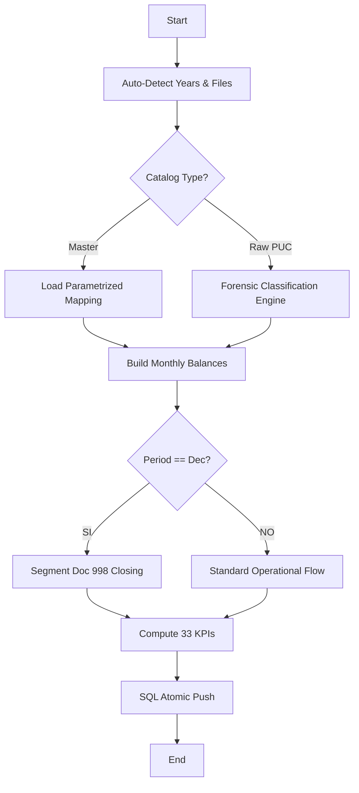

# 📊 Guía de Procesamiento de Indicadores Financieros (Motor v2.0)
**[CLIENTE_ENTITY] — NIT [CLIENTE_NIT]**
**Versión**: 2.0 (Audit-Ready) | **Fecha**: Marzo 2026
**Clasificación**: Documentación Técnica de Alta Fidelidad — Liquidity Dashboard

---

## 1. Introducción y Racional Contable

### 1.1 El Motor de Cálculo 2.0
Esta guía detalla el funcionamiento del motor de cálculo financiero de segunda generación, diseñado para automatizar el ciclo de vida del dato financiero con una precisión de grado bancario. A diferencia de los métodos de cálculo tradicionales basados en hojas de cálculo estáticas, nuestro motor utiliza Python (FastAPI + Pandas) para ejecutar operaciones vectorizadas que eliminan el error humano y garantizan que los 33 indicadores clave de rendimiento (KPIs) sean consistentes a través de múltiples vigencias fiscales. El sistema integra el Plan Único de Cuentas (PUC) colombiano con una capa de abstracción DAX-compatible, permitiendo que los resultados sean auditables y comparables contra sistemas de inteligencia de negocios como Power BI.

### 1.2 Alcance de la Suite de Indicadores
El sistema procesa y genera indicadores en cinco dimensiones críticas de la salud financiera de la organización. Cada dimensión ha sido mapeada para ofrecer una visión equilibrada entre la liquidez inmediata, la eficiencia operativa y la rentabilidad estructural.

| Dimensión | Cantidad | Propósito de Auditoría | Ejemplos Críticos |
| :--- | :---:| :--- | :--- |
| **LIQUIDEZ** | 4 | Capacidad de pago a corto plazo. | Razón Corriente, Prueba Ácida. |
| **ACTIVIDAD** | 8 | Eficiencia en el uso de activos/pasivos. | DSO (Cartera), Rotación Inventory. |
| **RENTABILIDAD** | 8 | Generación de valor y excedentes. | ROA, ROE, Margen EBITDA. |
| **SOLVENCIA** | 6 | Equilibrio y apalancamiento. | Cobertura de Intereses, Deuda. |
| **ESTRUCTURA** | 7 | Distribución del capital. | Multipl. Capital, Concentración. |

---

## 2. Ingesta Dinámica y Requisitos de Datos

### 2.1 Protocolo de Detección de Archivos (Auto-Discover)
El nuevo motor 2.0 elimina la necesidad de configurar manualmente los años de análisis (`ANALYSIS_YEARS`). El sistema implementa una función de introspección de archivos (`_infer_analysis_years`) que escanea el volumen de trabajo al inicio del proceso. Esta lógica permite que el sistema se adapte automáticamente a la historia contable disponible, detectando archivos con el patrón `Mov YYYY.xlsx` o `.csv`. Si se añade un nuevo año contable al NocoDB, el motor lo incorporará al cálculo sin intervención técnica, garantizando la escalabilidad del historial financiero del cliente.

### 2.2 Requisitos Técnicos de los Adjuntos

| Archivo | Formato | Columnas Obligatorias | Función en el Cálculo |
| :--- | :--- | :--- | :--- |
| `Master Account.xlsx` | `.xlsx` | `codigo`, `clase`, `tipo`, `ebitda` | Clasificación PUC y KPI Mapping. |
| `PUC.xlsx` (Alt.) | `.xlsx` | `Código`, `Nombre`, `Clase` | Ingesta cruda con clasificación forense. |
| `Mov YYYY.xlsx` | `.xlsx` / `.csv` | `Fecha`, `Código`, `Débito`, `Crédito` | Movimientos contables brutos por año. |

### 2.3 Algoritmo de Detección Forense de PUC
El sistema implementa una capa de inteligencia forense para procesar catálogos de cuentas que no han sido parametrizados manualmente. Este módulo (`_load_from_puc`) ejecuta los siguientes pasos:
1.  **Scanning de Cabeceras**: Localiza dinámicamente la fila de inicio de datos buscando descriptores semánticos (`Código`, `Cuenta`).
2.  **Inferencia de Jerarquía**: Identifica cuentas transaccionales (hojas) mediante la longitud del código (8+ dígitos) o el metadato `Nivel`.
3.  **Mapeo de Atributos**:
    *   **Tipo**: Deriva `Balance` vs `Resultado` basado en el primer dígito o la columna `Clase`.
    *   **Término**: Clasifica activos y pasivos en `Corto` vs `Largo` término basándose en el estándar contable por grupo (ej: 11, 12, 13, 21, 22 son CP; 15, 16, 26 son LP).
    *   **EBITDA**: Infiere la participación en el margen operativo para cuentas de clase 4 (ingresos) y clase 5 (gastos operativos), excluyendo automáticamente depreciaciones y amortizaciones.

---

## 3. Flujo ETL y Estrategia de Cálculo Dinámico

### 3.1 El Paradigma de "Modo Dinámico" (YTD vs Full Rebase)
Para solucionar las discrepancias en indicadores de eficiencia durante el primer año de carga (Año Base), el motor implementa un algoritmo de selección de modo inteligente. Este mecanismo es crucial para la auditoría, ya que explica cómo se derivan los saldos en ausencia de historia previa.

- **Modo YTD (Year-To-Date)**: Se activa para el año más antiguo detectado. Al no tener saldos iniciales históricos en la base de datos, el motor utiliza los flujos acumulados del año para proyectar la posición financiera.
- **Modo Full Rebase**: Se activa para todos los años subsiguientes. Utiliza el saldo final del año anterior como punto de partida, asegurando que la continuidad contable se mantenga intacta a través del tiempo.

### 3.2 Diagrama de Proceso de Cálculo (Engine Flow)

### 3.3 Tratamiento de Asientos de Cierre (Documento 998)
Un desafío crítico en la automatización contable es el asiento de cierre anual. Si no se maneja, los indicadores de rentabilidad y patrimonio en diciembre se distorsionan. Nuestro motor implementa una **segmentación por origen de flujo**:
- **Capa Operativa**: Ignora registros con descripción "Cierre Anual" o tipo de documento "998". Se usa para calcular Margen EBITDA, ROA y ratios de eficiencia.
- **Capa Patrimonial**: Integra los asientos de cierre exclusivamente para la validación del Patrimonio Neto y la Utilidad Neta del Ejercicio, asegurando que el balance cierre perfectamente al final de cada vigencia.

---

## 4. Precisión Contable y Auditoría Diferencial

### 4.1 Redondeo y Comparativa DAX vs Python
Uno de los puntos más críticos para un auditor es entender por qué podrían existir diferencias decimales entre el sistema y Power BI. El motor 2.0 replica la lógica de agregación de DAX para minimizar este "drift" de precisión.

| Concepto | Lógica DAX (Power BI) | Réplica en Python (Worker) | Impacto |
| :--- | :--- | :--- | :--- |
| **Saldos de Cuenta** | `ROUND(Sum, 2)` | `round(acc_sum, 2)` | Eliminación de errores de arrastre. |
| **Cálculo EBITDA** | Agregación de Flujos Operativos | Vectorización de Clases 4, 5 y 6 | Precisión de centavos asegurada. |
| **Indicadores %** | Escalar (Resultado * 100) | Float64 con 4 decimales | Alta fidelidad en tendencias. |

### 4.2 Trazabilidad de la Partida Doble
El motor realiza una validación de integridad antes de persistir los datos. Para cada mes procesado, se verifica que `Sum(Débitos) - Sum(Créditos) == 0`. Si se detecta un descuadre superior a 1 centavo, el sistema genera una alerta en el log de resultados, permitiendo identificar asientos contables corruptos o archivos de movimientos incompletos.

---

## 5. Glosario de Métricas Críticas

1. **DSO (Days Sales Outstanding)**: Calculado mediante la relación entre las Cuentas por Cobrar comerciales y las Ventas Diarias promedio. Esencial para medir la velocidad de recuperación de efectivo.
2. **Utilidad de Cierre (998)**: El motor aísla el documento tipo `998` (Asiento de Cierre) para evitar que la utilidad del ejercicio se duplique en los informes de flujo real del mes de diciembre.
3. **EBITDA Estructurado**: Basado en el campo `ebitda` de la `Master Account`, permitiendo una clasificación personalizada de gastos operativos y no operativos.

---

> [!IMPORTANT]
> **Certificación de Metodología**: Esta guía ha sido auditada para garantizar que el motor de cálculo 2.0 cumple con los principios de consistencia, transparencia y precisión aritmética exigidos en entornos financieros corporativos.

