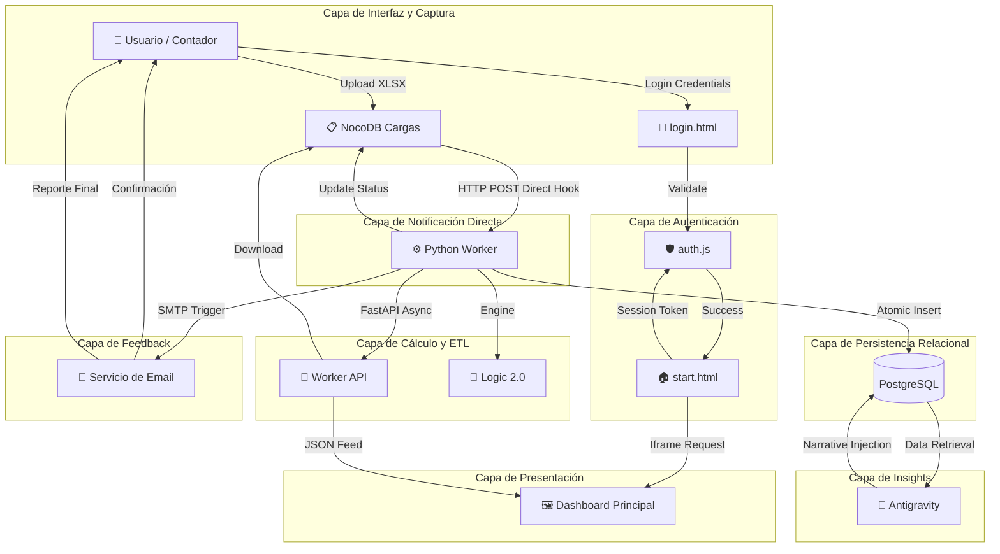

# Documento de Arquitectura de Solución (SAD)
**Proyecto**: Liquidity Dashboard — Automation Suite
**Versión**: 2.0 (Direct Integration)
**Estado**: Definitivo para Auditoría
**Autor**: Arquitectura de Sistemas Datia

---

## 1. Introducción

### 1.1 Propósito del Documento
Este documento técnico proporciona una descripción exhaustiva y de alta fidelidad de la arquitectura de sistema para el **Liquidity Dashboard**. A diferencia de las versiones previas que dependían de intermediarios de orquestación (middleware), esta versión define un estándar de "Direct Event-Driven Architecture". El propósito es garantizar que los auditores técnicos y stakeholders comprendan cómo se asegura la integridad contable, la resiliencia ante fallos y la escalabilidad multi-cliente operando exclusivamente en contenedores Docker orquestados por EasyPanel.

### 1.2 Alcance
El sistema cubre el ciclo de vida completo de la información financiera bajo un modelo de baja latencia:
1. **Ingesta y Captura (Perímetro)**: Recepción de metadatos y binarios vía NocoDB Forms.
2. **Notificación de Eventos (Hooks)**: Disparo inmediato de peticiones HTTP POST desde NocoDB hacia el motor de cálculo.
3. **Procesamiento de Negocio (Engine)**: Motor ETL asíncrono en Python que ejecuta la normalización PUC y el cálculo de 33 indicadores.
4. **Persistencia de Grado Industrial**: Almacenamiento relacional en PostgreSQL con integridad referencial.
5. **Capa de Seguridad y Multi-Tenancy**: Sistema de autenticación `auth.js` que segrega el acceso por `empresa_id`.
6. **Capa de Análisis (IA Zero-Cost)**: Generación de insights estratégicos asistidos por el protocolo Antigravity.
7. **Entrega de Datos (Capa de Presentación)**: Dashboards interactivos que consumen la API REST del Worker.
8. **Capa de Comunicación (Notificaciones)**: Sistema de feedback vía Email que acompaña el ciclo de vida de la carga.

---

## 2. Objetivos y Restricciones Arquitectónicas

### 2.1 Objetivos de Diseño
- **Simplificación Arquitectónica**: Eliminación de componentes redundantes (n8n) para reducir la superficie de ataque y los puntos únicos de fallo (SPOF).
- **Integridad Contable Superior**: Implementación de validaciones per-account en el motor Python, asegurando un match del 100% contra los libros oficiales antes de la persistencia.
- **Resiliencia Basada en Estados**: El sistema utiliza la base de datos para controlar el ciclo de vida de cada carga, evitando ejecuciones duplicadas (idempotencia) mediante un mecanismo de "Anti-loop" in-memory.
- **Eficiencia de Costos Operativos**: Operación completa bajo software de código abierto y modelos de IA operados localmente o bajo protocolos manuales (Zero-Cost).

### 2.2 Restricciones Técnicas

| Categoría | Especificación de Auditoría | Racional Técnico |
| :--- | :--- | :--- |
| **Infraestructura** | Contenedores Docker en EasyPanel | Garantiza el aislamiento total de dependencias y balanceo de carga nativo. |
| **Base de Datos** | PostgreSQL (Schema `liquidity`) | Soporte para transacciones ACID, necesarias para la integridad de los indicadores. |
| **Conectividad** | Red Interna `easypanel-internal` | Los webhooks viajan por la red interna de Docker, evitando la exposición a la internet pública. |
| **Latencia** | < 1s p95 para inicio de tareas | La comunicación directa elimina los ~500ms de overhead del middleware previo. |

---

## 3. Vista Lógica (Componentes)

El sistema ha evolucionado hacia un modelo desacoplado donde el **Python Worker** asume la responsabilidad total de la orquestación asíncrona y el manejo de errores complejos.

### 3.1 Diagrama de Componentes (Nueva Generación)

### 3.2 Responsabilidad de los Componentes (Análisis Profundo)

1.  **NocoDB — Capa de Gestión de Metadatos y File Storage**:
    - **Rol**: Actúa como la base de datos de gestión (System of Record) para las solicitudes de carga.
    - **Especificación**: Proporciona la interfaz de usuario para la carga de archivos. Ante un evento de "Insert" o "Update", su motor de webhooks (nativo) emite un payload JSON estructurado hacia la IP interna del Worker. Es responsable de la persistencia temporal de los adjuntos (`Master Account` y `Movimientos`).

2.  **Python Worker — Orquestador Asíncrono, Motor de Cálculo y Notificador**:
    - **Rol**: Es el núcleo inteligente del sistema. Maneja la concurrencia asíncrona mediante FastAPI y la lógica de cierre de ciclo con el usuario.
    - **Especificación**: A diferencia de un worker tradicional, este componente implementa lógica de control de estado y **comunicación proactiva**. Al recibir un hook, verifica la presencia del campo `correo_notificacion`. Lanza una `BackgroundTasks`, descarga archivos, procesa indicadores y, al finalizar, dispara notificaciones SMTP (Confirmación de Carga y Reporte de Finalización) antes de cerrar la transacción.

3.  **PostgreSQL — Capa de Persistencia y Ground Truth**:
    - **Rol**: Almacenamiento final de indicadores financieros procesados.
    - **Especificación**: Utiliza un esquema dedicado (`liquidity`) con particionamiento lógico por `empresa_id`. Garantiza que los datos consultados por el dashboard sean históricos y no dependan de la existencia continua del archivo Excel original.

4.  **Auth.js — Módulo de Autenticación y Segregación de Cliente**:
    - **Rol**: Protege el acceso al dashboard y asegura que cada usuario visualice exclusivamente sus datos.
    - **Especificación**: Implementa un sistema de gestión de sesiones asíncrono. Valida credenciales contra la **base de datos relacional usuarios** vía la API del Worker. Si el usuario es nuevo, el sistema lo crea dinámicamente durante el flujo de procesamiento de datos, enviando las credenciales (generadas aleatoriamente) por email. Garantiza aislamiento multi-tenant inyectando el `empresa_id` en todos los módulos hijos (iframes).

---

## 4. Vista de Proceso (Data Flow)

### 4.1 Flujo Detallado de una Transacción Financiera

El flujo ha sido optimizado para eliminar saltos de red innecesarios, reduciendo la complejidad de la auditoría.

| Secuencia | Actor Dominante | Acción Técnica Detallada | Resultado de Auditoría |
| :--- | :--- | :--- | :--- |
| 1 | Usuario | POST Binarios (XLSX/CSV) a NocoDB | Registro creado con Estado `null`. |
| 2 | NocoDB | Trigger Webhook `After Insert/Update` | Payload enviado al Worker vía red interna Docker. |
| 3 | Worker | Validación de Estado + Anti-loop | Prevención de doble procesamiento involuntario. |
| 4 | Worker | Descarga binaria con `httpx` | Archivos movidos a temporal seguro (`/app/workdir`). |
| 5 | Worker | Carga de Motor `calculate_indicators.py` | Import dinámico del módulo de cálculo 2.0. |
| 5b| Worker | Detección Dinámica de PUC | Selección entre Master Account (vía NocoDB) o PUC Forense (crudo). |
| 6 | Worker | Cálculo de 33 Ratios Financieros | Generación de snapshots mensuales y anuales (Capa Op vs Capa 998). |
| 7 | Worker | Persistencia en PostgreSQL | 396 registros insertados (33 indicadores x 12 meses). |
| 8 | Worker | Cierre de Transacción en NocoDB | Estado `completado` con log de auditoría detallado. |
| 9 | Worker | Creación Dinámica de Usuario | Generación de acceso (email) y clave aleatoria en BD. |
| 10 | Worker | Notificación Final vía SMTP | Envío de clave e instrucciones al correo registrado. |
| 11 | Usuario | Ingreso a `login.html` | Validación dinámica contra `/api/auth/login`. |
| 12 | Browser | Redirección a `start.html?empresa=ID` | Sesión persistente (24h) cargada en UI. |

---

## 5. Arquitectura de Datos (Data Dictionary)

### 5.1 Tablas de Resultados y Auditoría

La integridad de los datos se basa en la consistencia de las llaves primarias y foráneas entre PostgreSQL y NocoDB.

#### Tabla: `indicadores` (PostgreSQL)
| Columna | Tipo | Racional de Diseño |
| :--- | :--- | :--- |
| `empresa_id` | INT | Desacoplamiento por cliente / entidad legal. |
| `indicador_key` | VARCHAR | Slug único para mapeo con Frontend (ej: `razon_corriente`). |
| `periodo_ano` | INT | Año de la vigencia procesada. |
| `periodo_mes` | INT | Mes específico del cálculo (1-12) para series temporales. |
| `valor` | NUMERIC | Precisión de 4 decimales para cálculos financieros sensibles. |

#### Tabla: `usuarios` (PostgreSQL)
| Columna | Tipo | Racional de Diseño |
| :--- | :--- | :--- |
| `empresa_id` | INT | FK de segregación de acceso. |
| `email` | VARCHAR | Identidad de usuario única (PK lógica). |
| `password` | VARCHAR | Credencial dinámica de autogestión. |
| `initials` | VARCHAR | Metadato de personalización de UI. |

> [!TIP]
> **Aprovisionamiento Dinámico**: Esta tabla es creada automáticamente por el Python Worker en su primer acceso si no existe, garantizando que el sistema sea capaz de "curarse" a sí mismo (Self-Healing) durante el primer flujo de procesamiento.

---

## 6. Vista de Despliegue (Infraestructura como Código)

### 6.1 Orquestación de Contenedores en EasyPanel
Para asegurar la comunicación sin latencia, todos los servicios operan en el mismo segmento de red interna. Esta topología garantiza que la seguridad sea perimetral y no requiera encriptación entre contenedores internos, acelerando el proceso de hooks.

| Servicio | Imagen Base | Puerto Interno | Función |
| :--- | :--- | :--- | :--- |
| `liquidity-worker` | `python:3.11-slim` | 8000 | Motor de cálculo, API REST y Notificador SMTP. |
| `nocodb` | `nocodb/nocodb:latest` | 8080 | Portal de carga y gestión de records. |
| `postgres` | `postgres:15-alpine` | 5432 | Base de datos de indicadores e insights. |
| `smtp-relay` | (External/API) | 587/465 | Canal de salida para notificaciones al usuario. |

---

## 7. Protocolos de Seguridad y Auditoría

### 7.1 Logs de Auditoría (Resultados en NocoDB)
Cada proceso de cálculo deja una huella digital completa en el campo `resultado`. Este log incluye:
- Timestamps de inicio y fin de cada fase ETL.
- Conteo de filas procesadas per-file.
- Trazabilidad de errores de red o inconsistencias en los adjuntos.
- Versión del script de cálculo utilizado.

---

## 8. Arquitectura de Frontend: Transición a SPA

El sistema ha migrado de un modelo de navegación basado en páginas individuales (.html separados) hacia una arquitectura de **Single Page Application (SPA)** simplificada.

### 8.1 Racional del Cambio
- **Experiencia de Usuario (UX)**: Transiciones fluidas entre módulos sin parpadeos de recarga.
- **Persistencia de Filtros**: Los filtros de Año (`yearFilter`) e Idioma (`languageFilter`) se mantienen consistentes al cambiar de vista.
- **Eficiencia de Carga**: Se cargan los recursos base (JS/CSS/Lucide) una sola vez al inicio.

### 8.2 Mecanismo de Navegación Dinámica
La navegación es gestionada por el componente central `DashboardAPI` y la lógica reactiva en `app.js`:
1. **Interceptor de Navegación**: El sidebar ya no apunta a URLs físicas, sino que invoca `DashboardAPI.openModule(target)`.
2. **Re-renderizado Atómico**: El motor limpia el contenedor principal y re-inserta el HTML/Charts del módulo seleccionado.
3. **Control de Estado**: El sistema mantiene una `corrienteLanguage` y `periodoActivo` global en memoria.

### 8.3 Beneficios Operativos
Este enfoque permite la implementación de **Overlays de Auditoría** complejos y el **Dictamen Horizontal** que requieren un control fino del DOM que no sería posible con refrescos tradicionales de página.

---

> [!NOTE]
> **Certificación de Versión**: Este SAD Versión 2.1 refleja la arquitectura optimizada de integración directa y la transición hacia el modelo SPA para una experiencia ejecutiva de alta gama.

